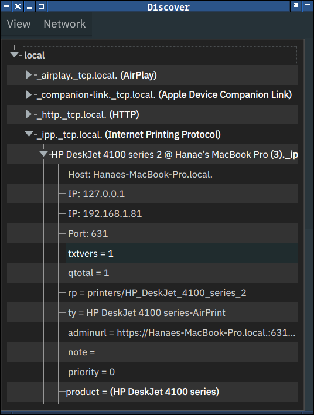

# Bonjour Discovery GUI



A lightweight, cross-platform Zeroconf/Bonjour browser built with PyQt6 and [zeroconf](https://pypi.org/project/zeroconf/).

---

## What it does

- **Discovers** all mDNS/Bonjour services on the local network.
- **Lists** service types (e.g. `_http._tcp.local.`), instances, hostnames, IP addresses, ports, and TXT-record properties.
- **Updates** in real time as services appear, update, or disappear.
- **Emulates** the macOS “Bonjour Browser” app in a minimal, free/open-source form.

## Why it exists

- Apple’s Bonjour Browser is macOS-only and not actively maintained.
- Cross-platform alternatives are often bloated or lack a GUI.
- This app gives you:
  - A **native PyQt6** interface (runs on macOS, Linux, Windows).
  - Fine-grained control over styling (dark/light/system themes, adjustable font sizes).
  - A **single executable** via `py2app` or packaged `.pkg` installer with `pkgbuild`.

## How it works

1. **Zeroconf thread**  
   A background `QThread` uses `zeroconf.ServiceBrowser` to:
   - Query `_services._dns-sd._udp.local.` for service types.
   - Listen for advertised instances of each type.
   - Emit updates back to the Qt GUI.

2. **Qt GUI**  
   - A `QTreeWidget` displays “local” → _service type_ → _instance name_ → _details_.  
   - A custom delegate (`BoldParenthesisDelegate`) renders type names like  
     `_http._tcp.local. (Web Server)` with the human-readable label in **bold**.  
   - Theme and font menus let you switch between dark/light/system themes and three font sizes at runtime.

3. **Packaging**  
   - **macOS `.app`** via `py2app` (see `setup.py`).  
   - **Installer `.pkg`** via `pkgbuild` (see `build-pkg.sh`), placing the `.app` into `/Applications`.

---

## Requirements & Installation

- Python 3.9+  
- PyQt6  
- zeroconf

```bash
pip install PyQt6 zeroconf